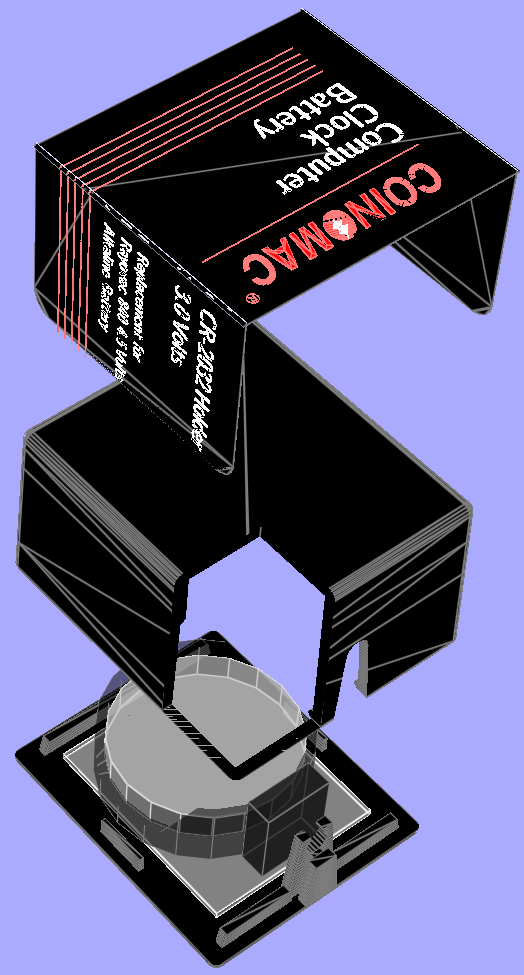

# Coin-O-Mac CR2032 battery replacement for Rayovac 840

<!---->

## Features

This is designed as a replacement and parody of the vintage *Rayovac 840 4.5V Alkaline Battery* for use in old Macintosh computers, which are now quite expensive, and don't look as good as they used to. It allows using a 3V CR2032 coin cell instead, which is both cheaper and less dangerous for these old machines, while maintaining a period-accurate look. Yes, we know it will be hidden inside the case, but inside beauty counts as well!

**NOTE:** The CR2032 is only 3V instead of the 4.5V of the battery it replaces, so it might not work in all cases, and probably not last as long. Most real-time clock chips can accomodate the difference though and will still work, as is the case for (most?) Macintosh computers. In the event it doesn't work it should be possible to make a dual-CR2032 version by chaining two battery holders in series, and two partially-drained coin cells.

## Tested with

- Apple Macintosh
  - [Performa 630 (CD)](https://everymac.com/systems/apple/mac_performa/specs/mac_performa_630.html)

## Finding ready-made

TBD

## Do it yourself

TBD

### Bill of Material

TBD

### 3D printing

TBD

### Label printing

TBD

## TODO

- [ ] Publish CAD & label drawings.
- [ ] Test with other machines.

